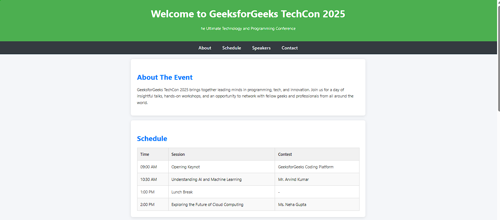
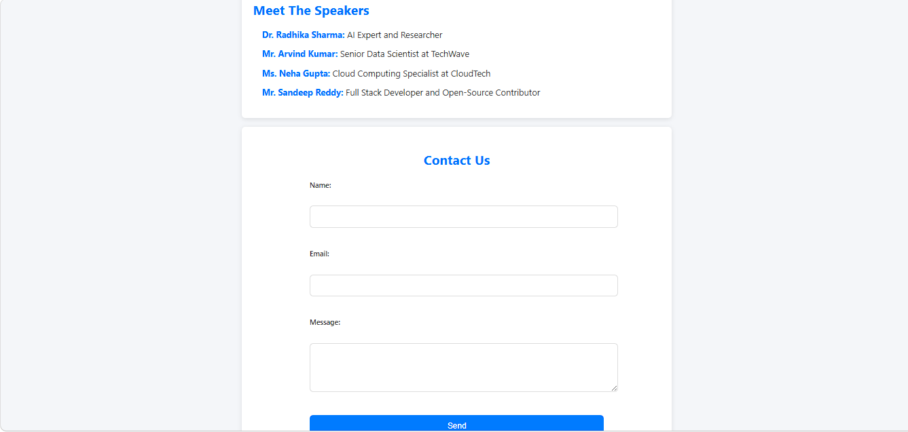

# 🎉 Design an Event Webpage using HTML and CSS


---

## 📌 Deskripsi

Project ini merupakan implementasi sederhana pembuatan halaman web acara menggunakan HTML dan CSS.  
Halaman ini dirancang untuk menampilkan informasi penting seperti jadwal, pembicara, serta kontak secara rapi dan mudah diakses.

Cocok sebagai latihan dasar untuk memahami struktur layout dan styling website 🎯

---

## 🚀 Fitur

- 🏷️ Judul & pengantar acara
- 🔗 Navigasi antar section (About, Schedule, Speakers, Contact)
- 📊 Tabel jadwal acara
- 👨‍🏫 Daftar pembicara
- 📩 Formulir kontak sederhana

---

## 🛠️ Tech Stack

- HTML5
- CSS3

---

## 👀 Preview




---

## ▶️ Cara Menjalankan

1. Clone repository ini
   ```bash
   git clone https://github.com/achraflyy48/Design-an-Event-Webpage-using-HTML-and-CSS.git

2. Masuk ke folder project
   ```bash
   cd Design-an-Event-Webpage-using-HTML-and-CSS

3. Buka file index.html di browser<br>
   (Klik dua kali atau gunakan Live Server di VS Code)

---

✨ Simple project, clean design, dan cocok untuk portofolio frontend pemula.
